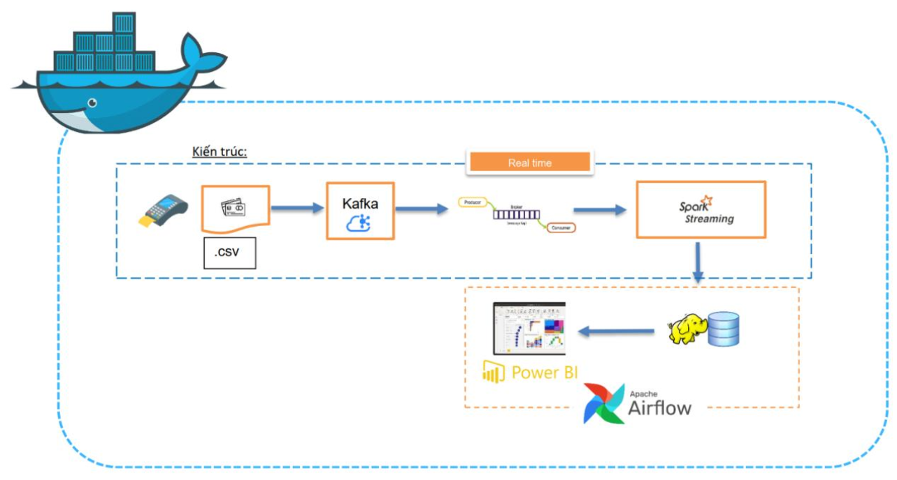

# Hệ Thống Phân Tích Giao Dịch Thẻ Tín Dụng Thời Thực

## 📋 Mô Tả Dự Án

Đây là một hệ thống xử lý dữ liệu **thời gian thực (Real-time)** toàn diện để phân tích giao dịch thẻ tín dụng. Hệ thống sử dụng các công nghệ Big Data hiện đại như **Kafka**, **Spark Streaming**, **Hadoop HDFS**, **Apache Airflow** để xử lý, lưu trữ và phân tích hàng triệu giao dịch một cách hiệu quả.

**Kiến trúc Pipeline:**

```text
┌─────────────────────────────────────────────────────────────────────────┐
│                          REAL-TIME PROCESSING                           │
├─────────────────────────────────────────────────────────────────────────┤
│                                                                         │
│  Data Sources →  Kafka → Spark Streaming → Hadoop HDFS                  │
│  (CSV/Payment)  (Queue)   (Processing)      (Storage)                   │
│                                                                         │
└─────────────────────────────────────────────────────────────────────────┘
                                    ↓
┌─────────────────────────────────────────────────────────────────────────┐
│                       BATCH PROCESSING & ANALYSIS                       │
├─────────────────────────────────────────────────────────────────────────┤
│                                                                         │
│  Daily Aggregate → Warehouse → Export → Power BI Visualization          │
│    (Analytics)     (Results)   (CSV)         (Dashboard)                │
│                                                                         │
└─────────────────────────────────────────────────────────────────────────┘
                                    ↓
┌─────────────────────────────────────────────────────────────────────────┐
│                        ORCHESTRATION & AUTOMATION                       │
├─────────────────────────────────────────────────────────────────────────┤
│                                                                         │
│  Apache Airflow DAG (Scheduled Daily at 23:00)                          │
│  - Daily Aggregate Task                                                 │
│  - Export PowerBI Task                                                  │
│  - Verify Output Task                                                   │
│                                                                         │
└─────────────────────────────────────────────────────────────────────────┘
```

---

## 🎯 Mục Tiêu Dự Án

1. **Xử lý dữ liệu thời thực** - Tiếp nhận và xử lý giao dịch theo luồng liên tục từ Kafka
2. **Phân tích giao dịch** - Tính toán các chỉ số phân tích theo ngày, tháng, năm
3. **Phát hiện gian lận & lỗi** - Xác định giao dịch bất thường và mô hình gian lận
4. **Đồ thị hóa dữ liệu** - Cung cấp dashboard Power BI tương tác phục vụ phân tích
5. **Tự động hóa quy trình** - Sử dụng Apache Airflow để lên lịch các tác vụ định kỳ

---

## 🏗️ Kiến Trúc Hệ Thống

### Các Thành Phần Chính

| Thành phần | Công nghệ | Cổng | Mục đích |
|-----------|----------|------|---------|
| **Kafka** | Apache Kafka 3.7.0 (KRaft Mode) | 9092 | Message Queue - Tiếp nhận giao dịch thời thực |
| **Spark Master** | PySpark 3.3.3 | 7077, 8081 | Xử lý dữ liệu phân tán - Streaming & Analytics |
| **Spark Worker** | PySpark 3.3.3 | - | Worker node cho Spark Cluster |
| **Hadoop NameNode** | Hadoop 3.2.1 | 8020, 9870 | Quản lý HDFS, lưu trữ dữ liệu phân tán |
| **Hadoop DataNode** | Hadoop 3.2.1 | - | Lưu trữ dữ liệu thực tế trên HDFS |
| **Airflow** | Apache Airflow 2.8.1 | 8085 | Lên lịch & quản lý workflow tự động |

---

## 📦 Chức Năng Chi Tiết Từng Thành Phần

### 1️⃣ **Producer** (`apps/producer.py`)
**Mục đích:** Gửi dữ liệu giao dịch vào Kafka queue

**Chức năng chi tiết:**
- ✅ Đọc file CSV chứa giao dịch thẻ tín dụng
- ✅ Gửi từng bản ghi vào Kafka topic `transactions`
- ✅ Thêm delay ngẫu nhiên 1-5 giây giữa các bản ghi (mô phỏng giao dịch thực tế)
- ✅ Xử lý lỗi & logging chi tiết

**Input:** `apps/User0_credit_card_transactions.csv`
**Output:** Dữ liệu được gửi vào Kafka topic `transactions`

```bash
docker exec -it spark-master python3 /opt/spark/apps/producer.py
```

---

### 2️⃣ **Spark Streaming** (`apps/spark_streaming.py`)
**Mục đích:** Xử lý dữ liệu thời thực từ Kafka và lưu vào HDFS

**Chức năng chi tiết:**
- ✅ **Consume từ Kafka** - Nhận dữ liệu từ topic `transactions` liên tục
- ✅ **Làm sạch dữ liệu** - Xóa ký tự đặc biệt, chuyển kiểu dữ liệu
- ✅ **Cập nhật tỷ giá USD-VND** - Lấy từ API hoặc web scraping (tự động cập nhật mỗi 20 giây)
- ✅ **Chuyển đổi tiền tệ** - Chuyển Amount từ USD sang VND
- ✅ **Chuẩn hóa cột dữ liệu** - Đặt tên cột theo chuẩn snake_case
- ✅ **Partition theo ngày** - Lưu dữ liệu dạng Parquet, tổ chức theo partition `ds` (ngày)
- ✅ **Kiểm tra điểm** - Lưu state để resume trong trường hợp gián đoạn

**Xử lý dữ liệu:**
- Kích thước dữ liệu: Mỗi giao dịch có ~15 cột
- Tỷ giá: `1 USD = ~25,380 VND` (cập nhật hàng ngày)
- Lưu trữ: HDFS Parquet format với partition theo ngày

**Input:** Kafka topic `transactions`
**Output:** HDFS `/datalake/transactions_clean/` (Parquet, partition by `ds`)

```bash
docker exec -u root -it spark-master /opt/spark/bin/spark-submit \
  --master spark://spark-master:7077 \
  --packages org.apache.spark:spark-sql-kafka-0-10_2.12:3.3.3 \
  /opt/spark/apps/spark_streaming.py
```

---

### 3️⃣ **Daily Aggregate** (`apps/daily_aggregate.py`)
**Mục đích:** Phân tích dữ liệu - Thành lập các báo cáo phân tích

**Các phân tích được thực hiện (8 yêu cầu):**

| # | Phân Tích | Chi Tiết | Output |
|---|----------|---------|--------|
| 1 | **Phân tích theo GIỜ** | Tìm khung giờ có nhiều giao dịch nhất, bất thường | `hourly_analysis/`, `hourly_unusual_analysis/` |
| 2 | **Phân tích theo THÀNH PHỐ** | Thành phố nào có giá trị giao dịch cao nhất | `city_analysis/` |
| 3 | **Phân tích theo MERCHANT** | Cửa hàng/nhà cung cấp nào có lượng giao dịch lớn | `merchant_analysis/` |
| 4 | **Phân tích HÀNH VI NGƯỜI DÙNG** | Người dùng có nhiều giao dịch, giao dịch nhanh liên tiếp | `user_analysis/`, `user_frequent/` |
| 5 | **Giao dịch GIÁ TRỊ LỚN** | Giao dịch ở top 5% giá trị cao (>= P95) | `high_value_analysis/` |
| 6 | **NGÀY THƯỜNG vs CUỐI TUẦN** | So sánh mô hình giao dịch weekday vs weekend | `weekday_vs_weekend/` |
| 7 | **Phân tích LỖI & GIAN LẬN** | Người dùng/merchant/giờ có lỗi, gian lận nhiều | `user_error_analysis/`, `fraud_*_analysis/` |
| 8 | **TỔNG QUAN HÀ NGÀY** | Thống kê tổng quan cho Power BI Dashboard | `daily_summary/` |

**Dữ liệu theo mức độ thời gian:** Day (Ngày), Month (Tháng), Year (Năm)

**Input:** HDFS `/datalake/transactions_clean/`
**Output:** HDFS `/warehouse/` (CSV format)

```bash
docker exec spark-master spark-submit /opt/spark/apps/daily_aggregate.py
```

---

### 4️⃣ **Export PowerBI** (`apps/export_powerbi.py`)
**Mục đích:** Chuyển dữ liệu từ Warehouse sang thư mục PowerBI để kết nối BI

**Chức năng chi tiết:**
- ✅ Đọc tất cả dataset từ `/warehouse/`
- ✅ Hợp nhất các file phân tán (coalesce) thành single CSV file
- ✅ Thêm header cho các cột
- ✅ Lưu vào `/powerbi/` thư mục

**Các dataset được export:**
- Day/Month/Year: Hourly Analysis, City Analysis, Merchant Analysis
- User Analysis: Hành vi người dùng, giao dịch liên tiếp
- Fraud Analysis: Gian lận theo giờ, thành phố, merchant
- Daily Summary: Tổng quan hàng ngày

**Input:** HDFS `/warehouse/*`
**Output:** HDFS `/powerbi/*.csv` (Ready for Power BI)

```bash
docker exec spark-master spark-submit /opt/spark/apps/export_powerbi.py
```

---

### 5️⃣ **Apache Airflow** (`airflow/dags/`)
**Mục đích:** Tự động hóa quy trình - Lên lịch chạy các tác vụ định kỳ

**DAG: `creditcard_daily_pipeline_exec`**
- **Lịch chạy:** Hàng ngày lúc 23:00 (11:00 PM)
- **Task 1:** `daily_aggregate` - Chạy phân tích hàng ngày
- **Task 2:** `export_powerbi` - Export kết quả cho Power BI
- **Task 3:** `verify_hdfs_output` - Kiểm tra kết quả

**Truy cập Airflow UI:**
```
URL: http://localhost:8085
Username: admin
Password: vQNhZZK46Sk4FKq6
```

---

## 📊 Kết Quả Đầu Ra

### 1. Cấu Trúc Dữ Liệu HDFS

```
hdfs://namenode:8020/
├── datalake/
│   ├── checkpoints/                         # Checkpoint cho Spark Streaming
│   │   └── transactions_clean/
│   └── transactions_clean/                  # Dữ liệu sạch từ Spark Streaming (Parquet)
│       ├── ds=2002-09-01/
│       ├── ds=2002-09-02/
│       └── ... (partition theo ngày)
│
├── warehouse/                               # Kết quả phân tích (CSV)
│   ├── hourly_analysis/(day, month, year)/
│   ├── hourly_unusual_analysis/(day, month, year)/
│   ├── city_analysis/(day, month, year)/
│   ├── merchant_analysis/(day, month, year)/
│   ├── user_analysis/
│   ├── user_frequent/
│   ├── high_value_analysis/(day, month, year)/
│   ├── weekday_vs_weekend/
│   ├── user_error_analysis/(day, month, year)/
│   ├── user_fraud_analysis/(day, month, year)/
│   ├── fraud_by_hour/(day, month, year)/
│   ├── fraud_by_merchant/(day, month, year)/
│   ├── fraud_by_city/(day, month, year)/
│   ├── fraud_rate_by_merchant/
│   └── daily_summary/
│
└── powerbi/                                 # Dữ liệu cho Power BI (CSV)
    ├── day_hourly_analysis.csv
    ├── month_hourly_analysis.csv
    ├── year_hourly_analysis.csv
    ├── day_city_analysis.csv
    ├── ... (tất cả dataset từ warehouse)
    └── daily_summary.csv
```

### 2. Power BI Dashboard
Trực quan hóa dữ liệu tương tác được cung cấp qua:
🔗 **[Xem Power BI Dashboard](https://app.powerbi.com/groups/me/reports/9091e33b-d824-4f3f-b856-438c29ebe451/3ef03fcf3487a2e90734?ctid=40127cd4-45f3-49a3-b05d-315a43a9f033&experience=power-bi&bookmarkGuid=0a6c68f3-6e5c-4dda-9e43-69318dc899ae)**

**Các biểu đồ chính:**
- 📈 Giao dịch theo giờ trong ngày
- 🏙️ Top thành phố có giá trị giao dịch cao nhất
- 🏪 Top merchant/cửa hàng
- 👥 Hành vi người dùng
- 🚨 Phân tích gian lận & lỗi
- 📊 So sánh weekday vs weekend
- 💰 Giao dịch giá trị lớn

### 3. Các Tập Tin Hỗ Trợ

| Script | Mục Đích | Khi Chạy |
|--------|---------|---------|
| `setup_hdfs_permissions.sh` | Tạo thư mục HDFS & cấp quyền | Lần đầu khởi động |
| `run_pipeline.sh` | Menu tương tác chạy từng bước | Debug/test từng component |
| `fix_permissions.sh` | Sửa quyền truy cập | Khi gặp lỗi Permission denied |

---

## 🚀 Hướng Dẫn Chạy

### Bước 1: Khởi động môi trường
```bash
docker compose up --build -d
docker ps  # Kiểm tra tất cả container đang chạy
```

### Bước 2: Setup HDFS (chỉ lần đầu)
```bash
chmod +x setup_hdfs_permissions.sh
./setup_hdfs_permissions.sh
```

### Bước 3: Chạy Pipeline
#### Cách 1: Chạy tự động (Khuyến nghị)
```bash
chmod +x run_pipeline.sh
./run_pipeline.sh
# Chọn option: 8 (Chạy tất cả)
```

#### Cách 2: Chạy thủ công từng bước
```bash
# Terminal 1: Producer
docker exec -it spark-master python3 /opt/spark/apps/producer.py

# Terminal 2: Spark Streaming
docker exec -u root -it spark-master /opt/spark/bin/spark-submit \
  --master spark://spark-master:7077 \
  --packages org.apache.spark:spark-sql-kafka-0-10_2.12:3.3.3 \
  /opt/spark/apps/spark_streaming.py

# Terminal 3: Daily Aggregate
docker exec spark-master spark-submit /opt/spark/apps/daily_aggregate.py

# Terminal 4: Export PowerBI
docker exec spark-master spark-submit /opt/spark/apps/export_powerbi.py
```

### Bước 4: Mở Power BI Dashboard
Truy cập dashboard tại: [Power BI Report](https://app.powerbi.com/groups/me/reports/9091e33b-d824-4f3f-b856-438c29ebe451/)

---

## 🛠️ Công Nghệ Sử Dụng

- **Apache Kafka 3.7.0** - Message Queue (KRaft Mode - không cần Zookeeper)
- **Apache Spark 3.3.3** - Xử lý dữ liệu phân tán (Streaming & Batch)
- **Hadoop 3.2.1** - HDFS (Distributed File System)
- **Apache Airflow 2.8.1** - Workflow Orchestration
- **Python 3.10** - PySpark, Kafka-Python, Pandas, Selenium
- **Docker & Docker Compose** - Containerization
- **Microsoft Power BI** - Data Visualization
- **CSV** - Định dạng dữ liệu
- **Parquet** - Định dạng lưu trữ tối ưu trên HDFS

---

## 📁 Cấu Trúc Thư Mục

```
XLPTDLTT_FinalProject/
├── apps/                                    # PySpark scripts
│   ├── producer.py                          # Kafka Producer
│   ├── spark_streaming.py                   # Spark Streaming Consumer
│   ├── daily_aggregate.py                   # Batch Analysis
│   ├── export_powerbi.py                    # Export to PowerBI
│   ├── download_powerbi.py                  # Download helper
│   └── User0_credit_card_transactions.csv   # Sample data
│
├── airflow/                                 # Apache Airflow
│   ├── dags/                                # DAG definitions
│   ├── logs/                                # Airflow logs
│   └── init-airflow.sh                      # Airflow initialization
│
├── guidelines/                              # Documentation
│   ├── guidelines.txt                       # Manual steps
│   └── rules_git.txt                        # Git rules
│
├── Dockerfile                               # Custom Spark image
├── docker-compose.yml                       # Container orchestration
├── PIPELINE_GUIDE.md                        # Detailed pipeline guide
├── setup_hdfs_permissions.sh                # HDFS setup script
├── run_pipeline.sh                          # Interactive menu
├── fix_permissions.sh                       # Permission fixer
└── README.md                                # This file
```

---

## ⚙️ Cấu Hình Hệ Thống

### Kafka (KRaft Mode)
- **Listener:** PLAINTEXT (nội bộ), PLAINTEXT_HOST (từ máy ngoài)
- **Topic:** `transactions`
- **Port:** 9092 (external), 29092 (internal)

### Spark Cluster
- **Master:** spark://spark-master:7077
- **Worker cores:** 2, Memory: 1G
- **Master UI:** http://localhost:8081

### Hadoop HDFS
- **NameNode:** hdfs://namenode:8020
- **Web UI:** http://localhost:9870

### Airflow
- **Executor:** SequentialExecutor
- **Port:** 8085
- **URL:** http://localhost:8085

---

## 📌 Lưu Ý Quan Trọng

1. **Quyền tệp:** Nếu gặp lỗi Permission denied, chạy `./fix_permissions.sh`
2. **Dữ liệu cũ:** Xóa `/powerbi/*` trước khi chạy lại: 
   ```bash
   docker exec namenode hdfs dfs -rm -r -skipTrash /powerbi/*
   ```
3. **Spark Streaming:** Giữ chạy liên tục để nhận dữ liệu từ Kafka
4. **Tỷ giá USD:** Tự động cập nhật mỗi 20 giây (config trong `spark_streaming.py`)
5. **Thời gian:** Airflow DAG chạy tự động lúc 23:00 mỗi ngày

---